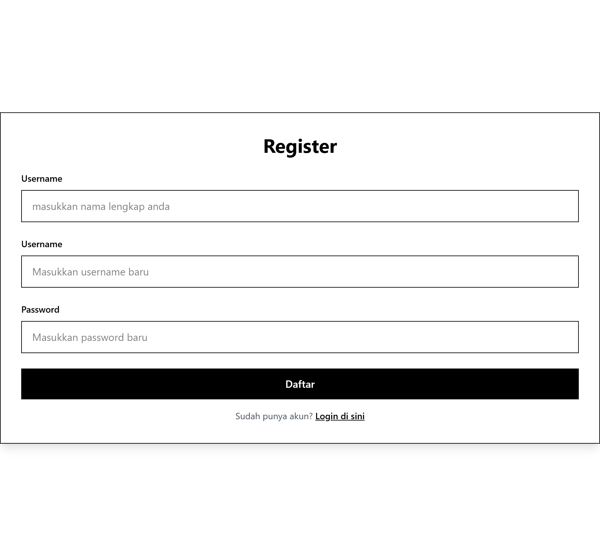
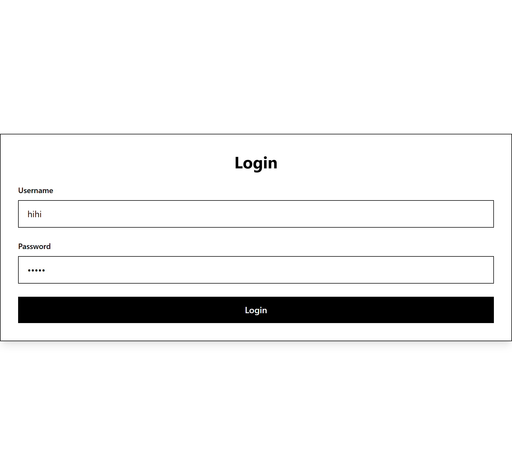

import

# React Login Authentication

Project sederhana React yang mengimplementasikan fitur Login menggunakan:

<ul>
<li> React
<li> Tailwind
<li> React Router DOM
</ul>

## Features

<ul>
<li> register menggunakan nama lengkap, username, dan password
<li> simpan data di local storage
<li> authentication state menggunakan context
<li> routing menggunakan react router DOM
<li> UI sederhana menggunakan tailwind
</ul>

### Screenshots

<table>
  <tr>
    <td align="center">
      
       
      <b>Register Page</b>
    </td>
    <td align="center">
      
       
      <b>Login Page</b>
    </td>
    <td align="center">
      
       
      <b>Home Page</b>
    </td>
  </tr>
</table>